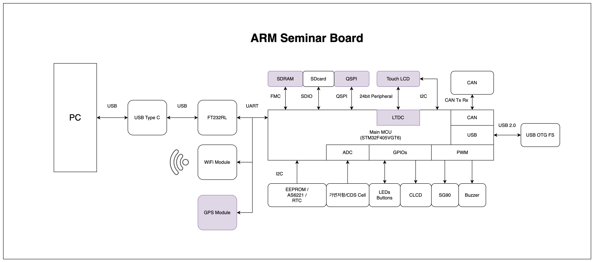
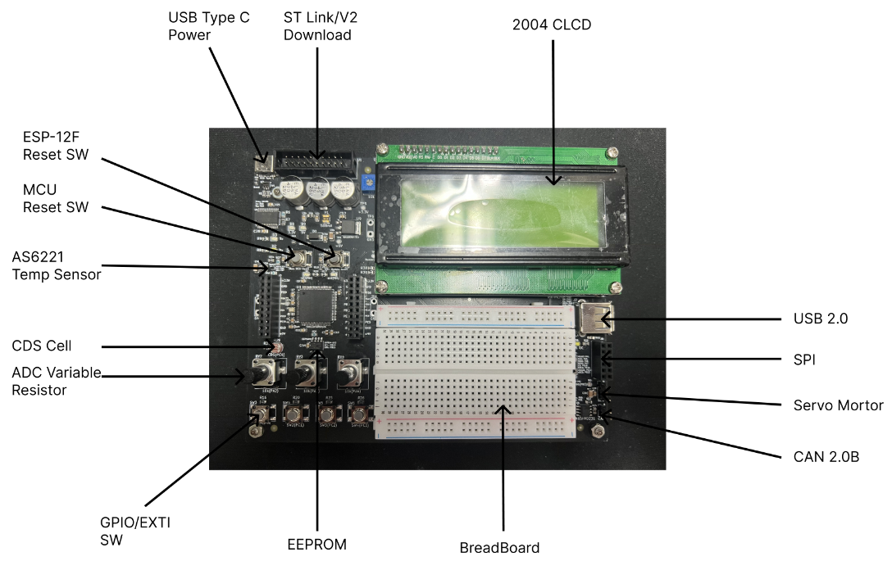
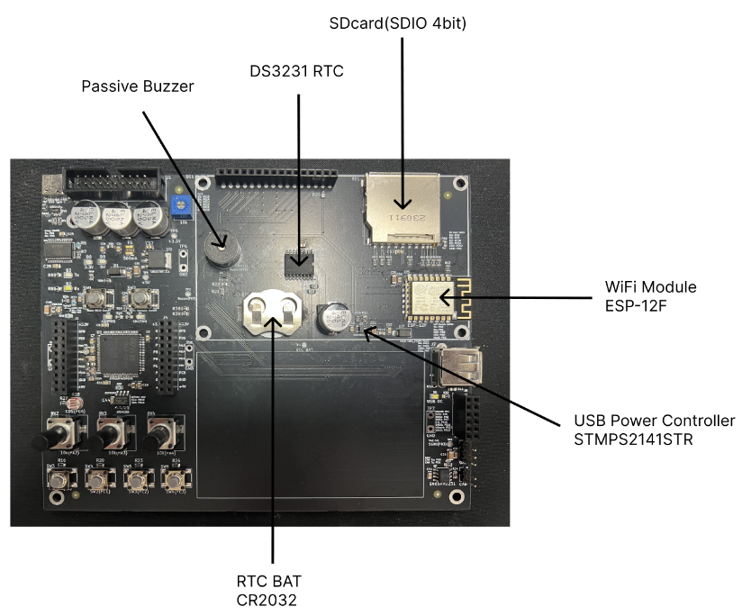

# ARM Seminar Board — Training Kit Rev 2.0

> **MCU:** STM32F405VGT6 (Cortex‑M4)  

ARM Seminar Board (Rev 2.0)는 GPIO부터 SDIO, FMC‑SDRAM, QSPI, CAN, USB, Wi‑Fi(IoT), RTC까지  
현업에서 자주 쓰는 주변장치를 **한 장의 보드에서 단계적으로 실습**할 수 있도록 구성한 트레이닝 키트입니다.

---

## Contents
- [Hardware overview](#hardware-overview)
- [Images](#images)
- [Getting started](#getting-started)
- [Peripheral quick map](#peripheral-quick-map)
- [Curriculum (16 + n)](#curriculum-16--n)
- [Revision notes](#revision-notes)
- [Repository layout](#repository-layout)
- [License](#license)

---

## Hardware overview

> 아래 구성은 **블록 다이어그램 / 보드 실크 라벨 기준**으로 정리했습니다.

### Core / Storage

| Category | Item | Interface / Notes |
|---|---|---|
| MCU | STM32F405VGT6 | Cortex‑M4 |
| microSD | microSD socket | **SDIO (4‑bit)** |

### USB / Debug

| Item | Notes |
|---|---|
| USB Type‑C | 5V 전원 / PC 연결 |
| USB OTG FS | USB 2.0 Full‑Speed |
| UART‑to‑USB | FT232RL 기반 로그/콘솔 |

### Display

| Item | Notes |
|---|---|
| 2004 CLCD | 캐릭터 LCD |

### Connectivity

| Item | Interface / Notes |
|---|---|
| Wi‑Fi module | ESP‑12F (**UART**) |
| CAN | CAN Tx/Rx + 커넥터 |

### Sensors / Inputs / Actuators

| Item | Notes |
|---|---|
| RTC | DS3231 + CR2032 |
| EEPROM | I2C |
| Temp sensor | AS6221 |
| Analog inputs | CDS Cell, 가변저항(ADC 실습) |
| User I/O | LEDs, Buttons, GPIO/EXTI 스위치 |
| Actuator | SG90 Servo(PWM), Passive Buzzer |

---

## Images

아래 폴더 구조를 기준으로 이미지를 참조합니다.

```text
arm-seminar/
└─ docs/
   └─ images/
      ├─ block_diagram.png
      ├─ board_front.png
      └─ board_back.png
```

### Block diagram


### Board photos
  


---

## Getting started

### Power
- **USB Type‑C**로 5V 전원 공급 (PC/어댑터 모두 가능)
- RTC는 **CR2032** 장착 시 전원 분리 후에도 시간 유지

### Flash / Debug
- **ST‑Link/V2 헤더**로 다운로드/디버깅
- 또는 **UART‑to‑USB(FT232RL)**로 시리얼 콘솔/로그 출력

### Recommended dev environment
- STM32CubeIDE, STM32CubeMX (권장)
- (선택) STM32CubeProgrammer, Logic Analyzer, CAN‑USB, USB‑TTL

---

## Peripheral quick map

교육 진행 시 “오늘 실습 대상”을 빠르게 체크할 수 있도록 묶었습니다.

- **GPIO / EXTI:** 버튼/스위치, LED  
- **ADC / DMA:** CDS Cell, 가변저항  
- **Timer / PWM:** Servo(SG90), Buzzer  
- **UART:** PC 디버그 콘솔, Wi‑Fi(ESP‑12F)  
- **I2C:** EEPROM, AS6221, DS3231(RTC)  
- **SPI:** 확장(예: VS1003 등)  
- **SDIO / FATFS:** microSD 파일 시스템  
- **CAN:** 보드 커넥터  

---

## Curriculum (16 + n)

세미나는 총 **16 + n회차**로 구성되며, 초급 → 고급으로 난이도가 점진적으로 상승하도록 설계했습니다.

- CubeIDE / GPIO / EXTI
- UART(폴링/인터럽트), printf 디버그
- CLCD 출력, ADC/DMA, Timer
- PWM/서보/버저 제어
- USB (예: Mass Storage)
- SDIO + FATFS, SPI, I2C, CAN
- FreeRTOS

---

## Revision notes

Rev 1.0 대비 주요 변경 사항 (요약)

- RTC 배터리 홀더 위치 변경(Back side)
- USB Type‑C 라인 다이오드 삭제
- UART 기반 업로드/연동 편의 개선
- 실크스크린 영역/사이즈 조정, 날짜/버전 업데이트

---

## License

**All Rights Reserved.**

본 저장소의 회로/PCB/문서/이미지/콘텐츠는 저작권자의 사전 서면 허가 없이  
**복제, 배포, 상업적 이용, 2차 저작물 제작**을 금지합니다.

교육/연구 목적의 검토가 필요하다면 저작권자에게 사용 허가를 요청해 주세요.  
자세한 내용은 `LICENSE`를 참조합니다.

© 2025 MyungHoon Jung. All rights reserved.
